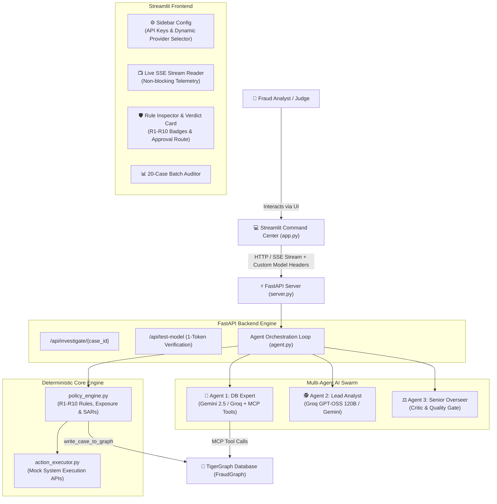
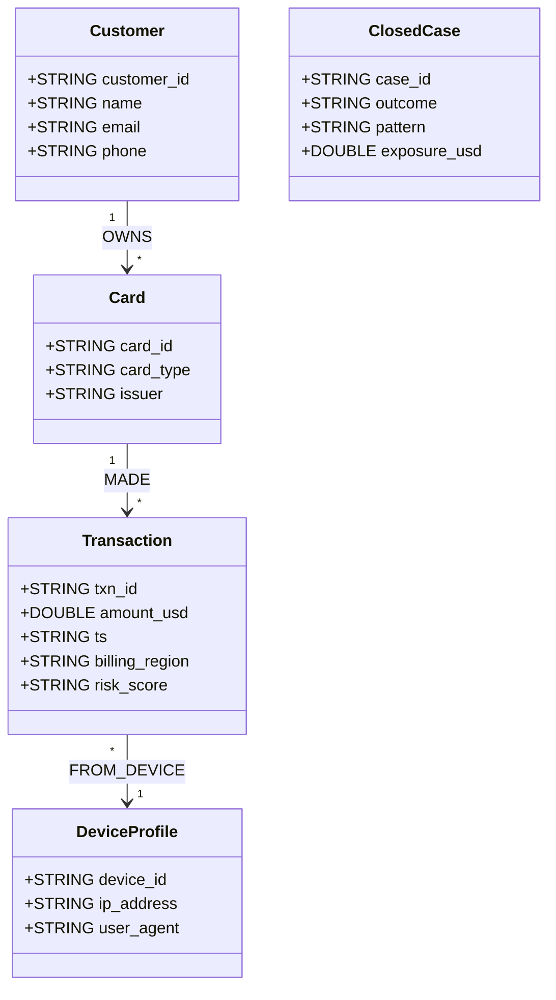

<table align="center">
  <tr>
    <td align="center" width="220">
      
    </td>
    <td align="left">
      <h1>HayMagnet 🧲</h1>
      <h3>Autonomous Multi-Agent AI Fraud Investigation System</h3>
      <p><em>TigerGraph × Hacker House Goa 2026 Flagship Challenge Entry</em></p>
    </td>
  </tr>
</table>

<p align="center">
  
  
  
  
  
  
</p>

---

## 🎯 Executive Summary & Problem Statement

Financial fraud investigation is notoriously complex: investigators must query deep graph topologies (connected credit cards, shared device profiles, IP clusters), evaluate rigid institutional policy rules, calculate exposure, and file regulatory Suspicious Activity Reports (SARs).

### Why Pure LLM Chatbots Fail in Financial Fraud:
- **Arithmetic Hallucinations:** LLMs frequently fail at floating-point transaction exposure sums.
- **Policy Drift:** LLMs invent non-standard approval routes or skip mandatory regulatory SAR filings.
- **Graph Invisibility:** Standard LLMs cannot natively traverse multi-hop graph database edges without structured tooling.

### The HayMagnet Solution:
**HayMagnet** is a **Hybrid Deterministic + Multi-Agent AI System**. It offloads high-level evidence synthesis, pattern detection, and reasoning to specialized AI agents while enforcing **100% deterministic Python-native policy rules, transaction math, and graph persistence**.

---

## 🏗️ System Architecture



---

## 🤖 The Multi-Agent Swarm Breakdown

HayMagnet divides investigation responsibilities across three specialized agent roles:

| Agent Role | Model Provider | Responsibilities |
| :--- | :--- | :--- |
| **🤖 Agent 1: DB Expert** | Gemini 2.5 Flash / Groq / HuggingFace | Translates investigator data requests into GSQL & MCP tools (`tigergraph__get_node_edges`, `tigergraph__get_node`, `tigergraph__run_query`). Fetches graph evidence. |
| **🕵️ Agent 2: Lead Analyst** | Groq `openai/gpt-oss-120b` / Gemini | Analyzes incoming triggers, requests graph evidence, queries past **Graph Case Memory**, identifies fraud patterns, and Formulates verdicts. |
| **⚖️ Agent 3: Senior Overseer** | Groq `openai/gpt-oss-120b` / Gemini | Acts as a strict quality gate. Reviews Agent 2's reasoning against gathered evidence to reject hallucinated or unevidenced conclusions. |
| **📊 Failure Forensic Analyst** | Groq / Gemini | If an investigation loop is inconclusive after maximum turns, analyzes the execution trace and generates a human-readable diagnostic report. |

---

## 🛡️ Deterministic Policy Engine (`policy_engine.py`) & Rules (R1–R10)

All financial calculations and regulatory rules are handled deterministically in Python to prevent LLM hallucinations:

### Institutional Rules Matrix:
- **R1 (High Risk Score):** Risk Score $\ge 80 \implies$ Flagged for High Fraud Risk.
- **R2 (Card Velocity):** $\ge 3$ transactions on new card within 1 hour $\implies$ Potential Card Testing.
- **R3 (Exposure Threshold):** Transaction Exposure $\ge \$2,500 \implies$ Mandatory L2 Approval & SAR Review.
- **R4 (Device Velocity):** $\ge 2$ distinct cards on single Device Profile $\implies$ Account Takeover Risk.
- **R5 (Pattern Detection):** Match known fraud patterns (`card_testing`, `out_of_region_use`, `account_takeover`).
- **R6 (Customer Validation):** Customer denies transaction $\implies$ Escalated to L1 Manual Review.
- **R7 (Cross-Border Multi-Card):** Out of region activity across multiple cards $\implies$ Immediate Card Block.
- **R8 (SAR Filing Requirement):** Confirmed Fraud or Exposure $\ge \$2,500 \implies$ File Regulatory SAR.
- **R9 (Approval Routing):** Assigns required approval tier (`AUTO_APPROVE`, `L1_MANUAL_REVIEW`, `L2_SAR_ESCALATION`).
- **R10 (Graph Memory Write):** Automatically persists closed case findings back to TigerGraph (`write_case_to_graph`).

---

## 🔌 Simulated Mock Action Execution Engine (`action_executor.py`)

Downstream operational actions recommended by the policy engine are executed through simulated mock APIs:

- 📩 `mock_send_customer_message(customer_id, text)`: Simulates customer SMS/Email validation & warning alerts.
- 🔒 `mock_freeze_account(account_id, reason)`: Simulates core banking account freeze (`ACT-FREEZE-xxxx`).
- 💳 `mock_block_card(card_id, reason)`: Simulates payment gateway card block (`ACT-BLOCK-xxxx`).
- 💵 `mock_refund_customer(txn_id, amount)`: Simulates issuing fraud chargeback refunds (`REF-xxxx`).
- 🎟️ `mock_update_crm_system(customer_id, note)`: Simulates audit ticket creation in CRM systems (`CRM-TICK-xxxx`).
- 📁 `mock_close_case(case_id, verdict)`: Simulates case resolution in the fraud operations hub.

---

## 🐯 TigerGraph Schema Topology (`FraudGraph`)



---

## 🚀 Installation & Quickstart

### 1. Prerequisites
- Python 3.10+
- TigerGraph Cloud Savanna Workspace
- API Keys: Google Gemini (`GEMINI_API_KEY`), Groq (`GROQ_API_KEY`), HuggingFace (`HF_TOKEN`)

### 2. Environment Setup
Create a `.env` file in the root directory:
```env
TG_HOST=https://your-workspace.i.tgcloud.io
TG_SECRET=your_tigergraph_secret_here
TG_USERNAME=tigergraph
TG_PASSWORD=tigergraph
GEMINI_API_KEY=your_gemini_api_key
GROQ_API_KEY=your_groq_api_key
HF_TOKEN=your_hf_token
```

### 3. Install Dependencies
```bash
pip install -r requirements.txt
```

### 4. Provision Database & Ingest Data
```bash
# Provision FraudGraph Schema
python setup_graph.py

# Extract Fraud Policy Rules
python extract_rules.py

# Ingest IEEE-CIS Dataset into TigerGraph
python load_data.py
```

### 5. Launch Unified Application
Simply run `run.py` to boot both the FastAPI backend and Streamlit frontend in separate terminal tabs:
```bash
python run.py
```
Open your browser at `http://localhost:8501`.

---

## 📄 Benchmark JSON Output Schema (HHGOA IEEE Compliant)

Final verdicts are formatted into a strict 3-part Pydantic JSON schema:

```json
{
  "case_id": "HHG-001",
  "case": {
    "status": "closed_fraud",
    "verdict": "fraud",
    "fraud_probability": 0.95,
    "pattern": "card_not_present_new_device",
    "exposure_usd": 3514.07,
    "written_to_graph": true,
    "graph_case_id": "CASE-2016-HHG-001"
  },
  "evidence_requests": [
    {
      "type": "customer_validation",
      "assumed_response": "Customer states they did not make these purchases."
    }
  ],
  "next_best_actions": {
    "initial": [
      { "action": "VERIFY_WITH_CUSTOMER", "route": "auto", "reason": "R6: Customer verification required." }
    ],
    "final": [
      { "action": "BLOCK_CARD", "route": "L2", "reason": "R3: Exposure $3,514.07 exceeds $2,500 threshold." },
      { "action": "FILE_REPORT", "route": "L2", "reason": "R8: Mandatory SAR filing triggered." }
    ],
    "what_changed": "Escalated to L2 approval following customer confirmation of unauthorized activity."
  },
  "sar": {
    "file": true,
    "reason": "R8: Mandatory SAR filing for confirmed fraud over $2,500.",
    "total_amount_usd": 3514.07
  }
}
```

---

## 🏆 Hacker House Goa 2026 Submission Summary

| Challenge Requirement | HayMagnet Feature Implementation |
| :--- | :--- |
| **Graph Database Analytics** | Direct TigerGraph MCP tool calling (`get_node_edges`, GSQL interpreted queries). |
| **Case Memory** | Deterministic write-back to TigerGraph (`write_case_to_graph`) & prompt-enforced historical case lookups. |
| **Policy Compliance** | 100% deterministic Python rule engine (`policy_engine.py`) for R1–R10 and approval matrix. |
| **Simulated Actions** | Mock execution engine (`action_executor.py`) for customer SMS, account freeze, card block, refunds, CRM. |
| **Multi-Provider Resilience** | Universal provider engine with live 1-token connection verification (`/api/test-model`) & fallbacks. |
| **Audit & Transparency** | Live SSE streaming telemetry, R1–R10 green/red rule badges, and 20-case batch auditor with CSV export. |

---

<p align="center">
  <em>Built with ❤️, ☕, and 🐯 TigerGraph for Hacker House Goa 2026.</em>
</p>
