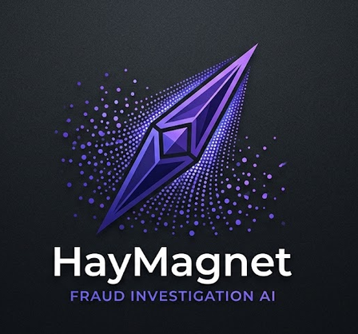

<table align="center">
  <tr>
    <td align="center" width="220">
      
    </td>
    <td align="center" width="220">
      <h1>HayMagnet</h1>
      <p><strong>AI Fraud Investigator</strong></p>
    </td>
  </tr>
</table>

<p align="center">
  <strong>AI-powered fraud investigation system for Hacker House Goa 2026</strong>
</p>

HayMagnet is an intelligent, multi-agent fraud investigation platform built to analyze suspicious transactions by combining graph analytics, retrieval, and LLM-driven reasoning. Instead of a single chatbot, the system uses multiple specialized AI agents to investigate a case, retrieve evidence from TigerGraph, and validate the final verdict before producing a structured result.

## Why this is AI-first

This project is not just a database app with a few prompts. The intelligence is built into the workflow:

- **Agent 1: DB Expert** uses **Google Gemini 3.6 Flash** to interpret the investigation request and call TigerGraph MCP tools.
- **Agent 2: Lead Investigator** uses **Groq Llama 3.1 70B** to reason about fraud rules, evidence, and next steps.
- **Agent 3: Senior Overseer** uses a second Groq model to review the final verdict and reject hallucinated or incomplete conclusions.
- **Fallback path** automatically switches to **Groq openai/gpt-oss-120b** when Gemini faces API rate limits.
- **Structured output** is generated by Groq into a clean JSON verdict for downstream use or reporting.

This makes HayMagnet a real AI-driven investigation pipeline rather than a static dashboard or template project.

---

## Architecture

HayMagnet is built around a graph-native fraud investigation pipeline:

### 1. Schema Provisioning

`setup_graph.py` provisions the `FraudGraph` schema in TigerGraph Cloud using `pyTigerGraph` and secure environment secrets.

### 2. Data Ingestion

`load_data.py` streams the large IEEE-CIS dataset in chunks for efficient ingestion into the graph database.

### 3. Multi-Agent AI Engine

`agent.py` orchestrates the full investigation loop:

- parse fraud rules
- request graph evidence
- analyze suspicious patterns
- review the decision for logic errors
- save a structured final verdict

### 4. Decoupled Client-Server Execution

`server.py` acts as the FastAPI backend managing the asynchronous agent workflows via Server-Sent Events (SSE). `app.py` provides the Streamlit UI client where users can select a case and watch the agents collaborate in real time without blocking.

---

## Key Components

- `agent.py` — orchestration logic for the investigation agents
- `server.py` — FastAPI backend for asynchronous agent execution and SSE streaming
- `tools.py` — TigerGraph MCP client and schema conversion utilities
- `app.py` — Streamlit web dashboard client
- `setup_graph.py` — graph schema creation
- `load_data.py` — data ingestion pipeline
- `extract_rules.py` — extracts fraud heuristics into `fraud_rules.txt`
- `logo.png` — HayMagnet branding asset

---

## Fraud Investigation Workflow

```text
Case trigger
   ↓
Lead Investigator decides whether more evidence is needed
   ↓
DB Expert calls TigerGraph through MCP tools
   ↓
Evidence is returned and analyzed
   ↓
Senior Overseer checks the conclusion for logic gaps or hallucinations
   ↓
Final structured verdict is saved as JSON
```

This design is specifically useful for suspicious transaction analysis, fraud pattern detection, and explainable investigation output.

---

## Tech Stack

- Python
- Streamlit
- TigerGraph
- Google Gemini
- Groq
- Hugging Face Inference
- Model Context Protocol (MCP)

---

## Running the project

### Prerequisites

1. TigerGraph Savanna workspace
2. `GEMINI_API_KEY`
3. `GROQ_API_KEY`
4. `HF_TOKEN`
5. IEEE-CIS dataset placed under `HHGOA_IEEE/`

### Setup

Create a `.env` file in the root directory:

```env
TG_HOST=https://your-tigergraph-workspace-url
TG_SECRET=your_database_secret
GEMINI_API_KEY=your_gemini_api_key
GROQ_API_KEY=your_groq_api_key
HF_TOKEN=your_hf_token
```

Install dependencies:

```bash
pip install -r requirements.txt
```

### Run

The application runs in a decoupled architecture, but we've provided a unified launch script for convenience.

Simply run the following command to automatically boot both the FastAPI backend and Streamlit frontend in separate terminal tabs/windows:

```bash
python run.py
```

_(Note: The frontend will gracefully poll and wait for the backend to come online before rendering.)_

---

## Project Goal

HayMagnet aims to demonstrate how AI agents can work together to investigate financial fraud using graph data, rule-based reasoning, and multi-step evidence gathering. The project is designed to be both operationally useful and presentation-ready for demos and hackathon evaluation.

---

_Built with ❤️ and ☕ for Hacker House Goa._
