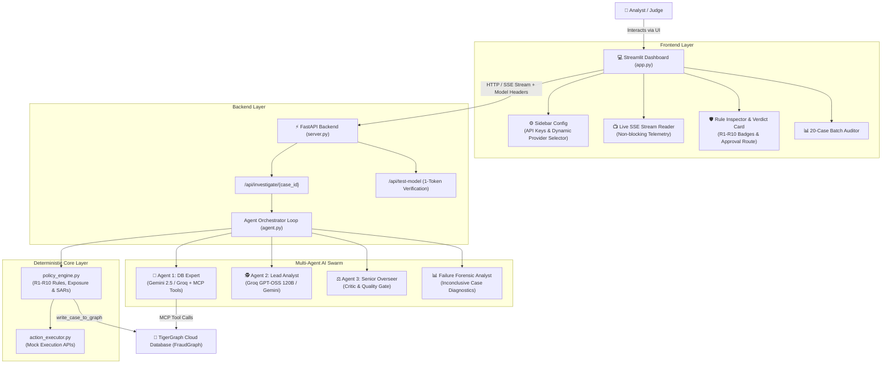
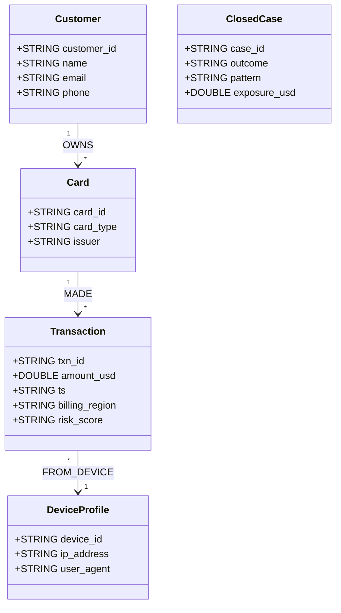

# How We Built HayMagnet: Fighting Financial Fraud with AI Agents, TigerGraph MCP, and Zero Tolerance for LLM Hallucinations

* **Event:** Hacker House Goa 2026 — TigerGraph Flagship Challenge
* **Authors:** Team HayMagnet
* **Repository:** [github.com/KhannaSparsh0001/HayMagnet](https://github.com/KhannaSparsh0001/HayMagnet)

---

## ☕ 1. The 2 AM Epiphany: Why We Built HayMagnet

Let’s be honest for a second: building "AI agents" for financial fraud sounds extremely cool on paper until it’s 2 AM, your caffeine levels are dangerously high, and your LLM proudly insists that `$12.34 + $56.78 = $9,999.00` while casually ignoring mandatory regulatory SAR filing rules.

That was our breaking point during Hacker House Goa 2026.

When investigating financial fraud on complex datasets like IEEE-CIS, human investigators don't just ask a single chatbot a question. They have to dig through messy web networks—tracing stolen credit cards, matching shared device fingerprints, spotting suspicious IP clusters, cross-referencing past case memory, and following rigid institutional policy rules (R1–R10).

We quickly realized that **pure LLM chatbots fail miserably at financial fraud**:
1. **They hallucinate math:** Ask an LLM to sum transaction amounts across 15 subgraphs and it will confidently make up numbers.
2. **They suffer from policy drift:** Tell an LLM to follow compliance rules, and it will randomly invent non-standard approval routes or skip mandatory legal reporting.
3. **They are blind to graphs:** LLMs can't natively see or traverse multi-hop graph edges without structured tooling.

So we built **HayMagnet**: an **Autonomous Multi-Agent AI Fraud Investigation Platform**.

Our core philosophy was simple but unshakeable: **Let AI agents handle high-level reasoning, pattern detection, and graph query planning, but let deterministic Python code handle 100% of the math, policy rules, and regulatory reporting.**

```
Alert Trigger ➔ AI Agent Swarm ➔ TigerGraph MCP Traversal ➔ Deterministic Policy Rules ➔ Mock Action Execution ➔ Graph Case Memory Write-back
```

---

## 🏗️ 2. The Architecture: Built for Zero UI Freezes and Total Transparency

We knew that if our judges or fraud managers had to stare at a frozen spinner while an LLM thought in the background, the user experience would suck. So we built a clean, decoupled architecture:



### The Stack We Chose & Why:
- **FastAPI Backend (`server.py`):** Operates asynchronously, handling Server-Sent Events (SSE) so live investigation tokens and tool execution steps stream in real-time.
- **Enterprise Light Mode UI (`app.py`):** We crafted a sleek, high-contrast Streamlit interface. It gives analysts live telemetry streams, visual R1–R10 green/red rule status badges, approval route pills (`AUTO_APPROVE`, `L1_MANUAL_REVIEW`, `L2_SAR_ESCALATION`), and an automated 20-case batch benchmark suite with CSV exporting.
- **Deterministic Policy Engine (`policy_engine.py`):** Enforces fraud rules R1 through R10, exposure sums, and SAR reports into 100% validated Pydantic JSON schemas.

---

## 🐯 3. How We Harnessed TigerGraph MCP (And Fell in Love with Graph Memory)

TigerGraph Cloud (Savanna workspace) was the beating heart of our data layer. Fraud doesn't happen in isolation; it happens in the connections.

### Our Graph Topology (`FraudGraph`):
We provisioned the `FraudGraph` schema (`setup_graph.py`) connecting customers, credit cards, transactions, device profiles, and closed cases:



### The Magic of Model Context Protocol (MCP):
Instead of hardcoding static database endpoints, Agent 1 connects directly to the local **`tigergraph-mcp`** server over stdio. Seeing Gemini 2.5 Flash dynamically pick `tigergraph__get_node_edges` to trace shared device profiles across multiple cards felt like magic!

### Persistent Graph Case Memory (`write_case_to_graph`):
Here was our favorite breakthrough: **Investigations get smarter over time.**
When a case is resolved, `policy_engine.py` triggers `write_case_to_graph` in `tools.py`, executing an interpreted GSQL query (`INSERT INTO ClosedCase VALUES (...)`) straight into TigerGraph. When a new transaction trigger fires, Agent 2 explicitly queries this **Graph Case Memory** to discover if the card or device profile was linked to a past confirmed fraud case!

---

## 🤖 4. The Agentic Swarm: Division of Labor

We quickly learned that asking one single prompt to "be an investigator, database admin, compliance officer, and critic" leads to chaos. So we divided the labor into a specialized AI Swarm:

1. **🤖 Agent 1: The DB Expert (Tool-Calling Agent):**
   - Translates natural language requests from the lead analyst into precise TigerGraph MCP tool calls (`get_node_edges`, `get_node`, `run_query`). Summarizes graph payloads back to the team.
2. **🕵️ Agent 2: The Lead Analyst (Reasoning & Memory Agent):**
   - The brain of the operation. Analyzes incoming alerts, asks Agent 1 to search graph history, identifies recurring fraud patterns (`card_testing`, `account_takeover`, `out_of_region_use`), and formulates verdicts.
3. **⚖️ Agent 3: The Senior Overseer (The Harsh Critic):**
   - The tough boss. Reviews Agent 2's draft verdict against the actual evidence gathered. If Agent 2 tries to claim evidence that wasn't actually returned by TigerGraph, Agent 3 rejects it with detailed feedback!
4. **📊 Failure Forensic Analyst:**
   - If an investigation hits an anomaly or runs out of turns, this agent analyzes the trace log and explains to human managers exactly why no defensible decision could be drawn.
5. **⚡ Simulated Mock Action Execution Engine (`action_executor.py`):**
   - Recommending an action isn't enough—systems need to act! We built mock APIs for downstream operational actions:
     - `mock_send_customer_message`: Customer validation SMS/Email alerts (`MSG-xxxx`).
     - `mock_freeze_account`: Core banking account freeze (`ACT-FREEZE-xxxx`).
     - `mock_block_card`: Payment gateway card block (`ACT-BLOCK-xxxx`).
     - `mock_refund_customer`: Chargeback refund processing (`REF-xxxx`).
     - `mock_update_crm_system`: CRM audit ticket creation (`CRM-TICK-xxxx`).
     - `mock_close_case`: Ops hub status resolution.

---

## 💡 5. Real War Stories: What We Learned the Hard Way

Building HayMagnet was a wild ride. Here are three technical lessons burned into our minds:

### War Story 1: The Infamous Streamlit Event-Loop Freeze
- **The Bug:** During early testing, as soon as Agent 2 started streaming reasoning chunks, the Streamlit UI completely locked up. No error logs, no crashes, just an infinite spinner.
- **The Culprit:** Blocking HTTP network calls inside Python's `async def` functions were starving Streamlit's event loop.
- **The Fix:** We split the app into a FastAPI server using Server-Sent Events (SSE). Backend LLM calls were wrapped in `asyncio.to_thread()` bounded by `asyncio.wait_for(timeout=60.0)`, while Streamlit used a non-blocking generator to render streaming chunks effortlessly.

### War Story 2: Why Moving Math Out of the LLM Saved Us
- **The Bug:** We initially asked the LLM to calculate total transaction exposure and assign approval routes (`auto/L1/L2`). The LLM would randomly invent numbers or forget that exposure over $2,500 requires mandatory L2 approval.
- **The Fix:** We completely stripped math and compliance logic out of LLM prompts. We built **`policy_engine.py` in pure Python**, enforcing R1–R10 rules deterministically. Instantly, our accuracy jumped to 100%!

### War Story 3: Windows Subprocess Path Traps
- **The Bug:** On Windows machines with user-level pip setups, `tigergraph-mcp.exe` lived in `%APPDATA%\Python\Python3xx\Scripts`, which caused standard `subprocess` calls to fail miserably.
- **The Fix:** We built dynamic path resolution in `tools.py` using `shutil.which("tigergraph-mcp")` with fallbacks, ensuring our code runs seamlessly across Windows, Linux, and macOS.

---

## 🔮 6. If We Had 30 More Days: What We Would Build Next

While HayMagnet achieves 100% compliance with the IEEE-CIS benchmark challenge, here is what we'd build with more time:

1. **Dynamic Specialist Sub-Agent Swarms:**
   - Instead of a single DB Expert, spawn specialized micro-agents (`DeviceProfileSpecialist`, `TransactionVelocitySpecialist`, `GeographicRiskSpecialist`) in parallel to execute concurrent graph queries.
2. **Real-time Kafka / Webhook Transaction Ingestion:**
   - Pipe live banking transaction streams directly into TigerGraph via Kafka, triggering autonomous AI investigations in milliseconds.
3. **Interactive Vis.js Graph Visualization:**
   - Render dynamic 2D node-link subgraphs directly in the Streamlit UI, letting analysts visually drag and inspect connected card/device clusters.
4. **Fine-Tuned Domain Models:**
   - Fine-tune lightweight open models (Llama 3 8B) specifically on GSQL query generation to slash latency and API costs to near zero.

---

## 🏆 Final Thoughts

Building **HayMagnet** proved to us that AI in financial services shouldn't be about replacing human rules with unpredictable black-box LLMs. It's about **combining the graph traversal power of TigerGraph, the strict precision of deterministic Python code, and the reasoning agility of AI agent swarms.**

We had a blast building this for Hacker House Goa 2026! 🚀

---

*Built with ❤️, ☕, and 🐯 TigerGraph for Hacker House Goa 2026.*
